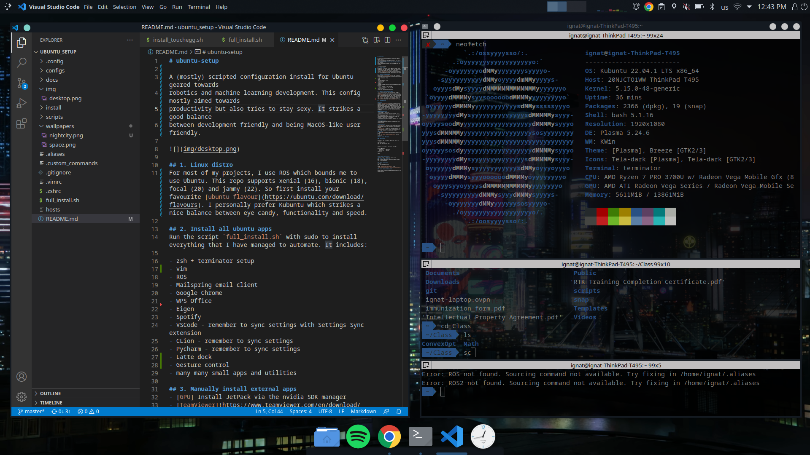

# ubuntu-setup
A semi-sripted guide of how to install and setup my Ubuntu config focused on robot software development with ROS.



## 1. Linux distro
For most of my projects, I use ROS which bounds me to use Ubuntu. This repo supports xenial (16),  bionic (18) and focal (20). So first install your favourite [ubuntu flavour](https://ubuntu.com/download/flavours). I personally prefer Kubuntu which strikes a nice balance between eye candy, functionality and speed.

## 2. Install all ubuntu apps
Run the script `full_install.sh` with sudo to install everything that I have managed to automate. It includes:

- zsh + terminator setup
- ROS
- Mailspring email client
- Google Chrome
- WPS Office
- vim
- Eigen
- Spotify
- VSCode - remember to sync settings with Settings Sync extension
- CLion - remember to sync settings
- Pycharm - remember to sync settings
- many many small apps and utilities

## 3. Manually install external apps
- [GPU] Install JetPack via the nvidia SDK manager 
- [TeamViewer](https://www.teamviewer.com/en/download/linux/)
- [Miniconda](https://docs.conda.io/en/latest/miniconda.html) - Note that Anaconda has some issues running with ROS. For this purpose remove the path sourcing for it from `.bashrc` and source it only whenever needed. For that purpose I have made a custom command called `start_conda` within the `.custom_commands.bash` file
- Install Popcorn time

## 4. Customisations

### Visuals
I use the [Aritim Dark Theme](https://www.pling.com/p/1281836) installed via the Workspace Theme in the System Setttings. Install it from there and set it along with the "Use desktop layout from theme setting". Next set the icons to La Capitane which you can install from the System Settings. Configure the taskbar to be the same as the screenshot. Finally go to System Settings/Window Management/Task Switcher and set the visualisation to Artim-Dark.

### Keyboard shortcuts
- File Manager - Super + E
- Global Shortcuts/System Shortcuts/Terminal - Ctrl + Alt + T
- Global Shortcuts/System Shortcuts/Switch workspaces - Ctrl + Alt + Arrow keys
- Global Shortcuts/System Shortcuts/Move window to workspace - Super + Alt + Arrow keys
- Keyboard Settings/Switch keyboard layouts - Alt + Shift

### System settings

- Search/Plasma Search - disable all folder and file related actions

### Useful scripts
- `stop_joy.bash` - when you connect a some joysticks to ubuntu, they start controlling your mouse. This script stops that but allows the joystick to still work as a joystick.
- `wifi_fix.bash` - on my Dell Latitude E5450, my wifi would sometimes refuse to connect to secure networks. This script fixes it for 1 connection attempt.

### Git setup
1. Setup [SSH key](https://docs.gitlab.com/ee/ssh/) for gitlab.
2. Use `git config credential.helper store` to save credentials

### Extra Nvidia GPU tweaks

#### Small scaling

issue where some UI elements apear tiny. To fix it:

```bash
sudo nvidia-config
sudo nano /etc/X11/xorg.conf 
```

and add a DPI option to the Monitor settings:

```
Section "Monitor"
    Identifier     "Monitor0"
    Option "DPI"   "96 x 96"
EndSection
```

reboot


### AMD Ryzen specific setup
These are issues I had with my Ryzen 7 3700U

#### Fixing system instability
Need to build and install newest Ryzen kernel from a link I don't have here

#### Fixing suspend bugs
edit grub
```bash
sudo vim /etc/default/grub
```
change `GRUB_CMDLINE_LINUX_DEFAULT` to be `GRUB_CMDLINE_LINUX_DEFAULT="quiet splash amd_iommu=off"`

#### Fixing reboot/shutdown issues

Install latest propriotrary Radeon Graphics drivers from the AMD website

